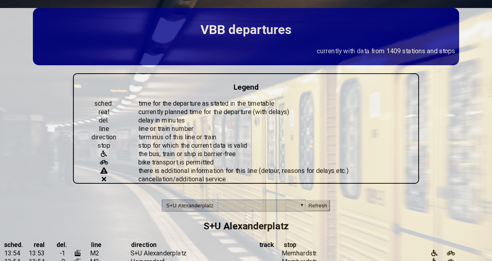

# VBB

This website was created by Stefan Klinkusch using React.js. It contains the departures for selected stations and tram/bus stops in and around Berlin.

## Features

It features

- an input field to search for stations
- a dropdown list with all available stations or a selection of them
- a refresh button to get the _current_ data for the selected station
- an input field to filter the _departures_ using the filter strings
- a list of departures including
  - the time, as it is stated in the timetable
  - the time when the bus/train will (hopefully) depart in real time
  - the delay in minutes (the difference between the times in the first two columns)
  - a symbol showing which product is meant
    -  for express trains
    -  for regional trains
    -  for suburban trains (S-Bahn)
    -  for subways (U-Bahn)
    -  for "metro" tramways
    -  for tramways
    -  for "metro" buses
    -  for express buses
    -  for normal buses (also night buses)
    -  for special buses (with special fares)
    -  for ferries
  - the line or train number
  - the destination of this line
  - the track on which the train is departing (in stations)
  - information about barrier-free means of transport
  - information about the possibilities of bike transport in the trains/buses/ferries
  - warnings concerning detours
  - status information, such as cancellations or additional service

## Sorting

The departures are sorted by

1. the stop from which they depart
1. the product they are using in the order:

- express trains
- regional trains
- suburban trains
- subways
- tramways
- buses (all kinds)
- ferries

3. the time they will (hopefully) depart (cancelled first, others later)

## Techniques

- HTML5
- SCSS/Sass
- Bootstrap
- React
- React Router with static URLs (BrowserRouter)
- React hooks
  <!-- - Redux -->
  <!-- - redux-saga -->
- axios

Further, it uses the [VBB proxy](https://github.com/sklinkusch/VBB-micro-proxy).

## Acknowledgments

- data: [Verkehrsverbund Berlin-Brandenburg (VBB)](http://www.vbb.de)
- data-management: [hafas-client](https://github.com/derhuerst/hafas-client)
- icons: [vbb-logos](https://github.com/derhuerst/vbb-logos)
- station data: [vbb-stations](https://github.com/derhuerst/vbb-stations)
- background image: [Unsplash](https://unsplash.com)
- Proxy: [Zeit.co](https://zeit.co/)
- Support to set up the proxy: [Leandro Frigerio](https://github.com/leandroDCI)

## Screenshot

## Link

[to the page](https://sklinkusch.github.io/VBB/)
