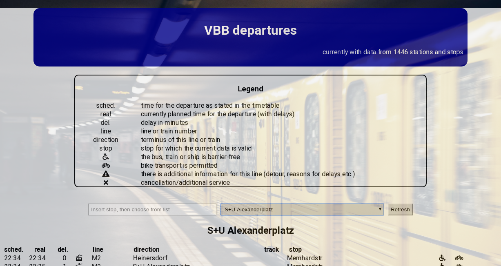

# VBB

This website was created by Stefan Klinkusch using React.js. It contains the departures for selected stations and tram/bus stops in and around Berlin.

## Features

It features a

- dropdown list with all available stations
- a refresh button to get the _current_ data for the selected station
- a list of departures with necessary data, such as
  - the time, as it is stated in the timetable
  - the time when the bus/train will (hopefully) depart in real time
  - the delay in minutes
  - the line or train number
  - the destination of this line
  - the track on which the train is departing (in stations)
  - the stop from which the bus/train will depart (sometimes, nearby stops are included in the list)
  - information about barrier-free means of transport
  - information about the possibilities of bike transport in the trains/buses/ferries
  - warnings concerning detours
  - status information, such as cancellations or additional service

## Credentials

- data: [Verkehrsverbund Berlin-Brandenburg (VBB)](http://www.vbb.de)
- data-management: [VBB-HAFAS package of Jannis Redmann](https://github.com/derhuerst/vbb-hafas)
- background image: [Unsplash](https://unsplash.com)

## Screenshot

## Link

[to the page](https://sklinkusch.github.io/VBB/)
